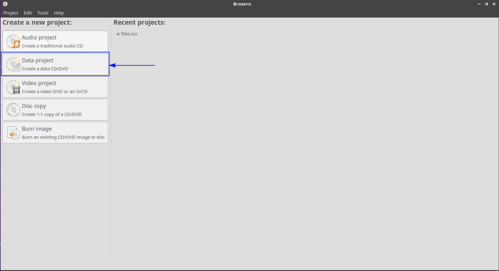
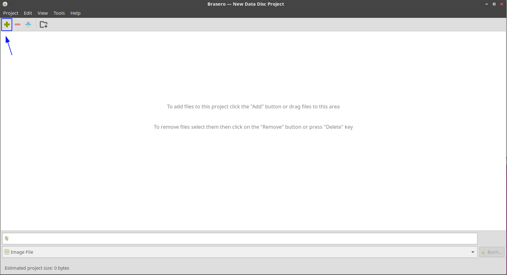
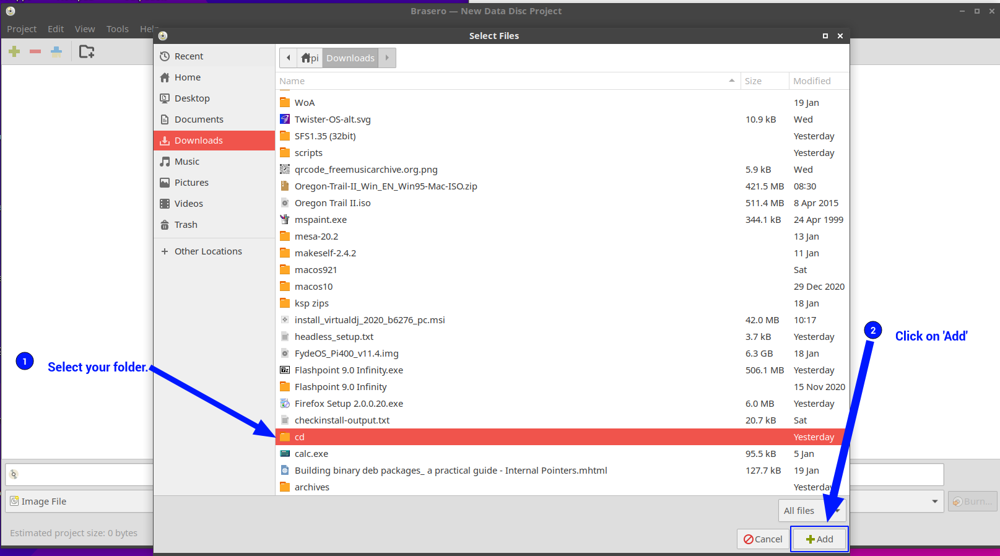
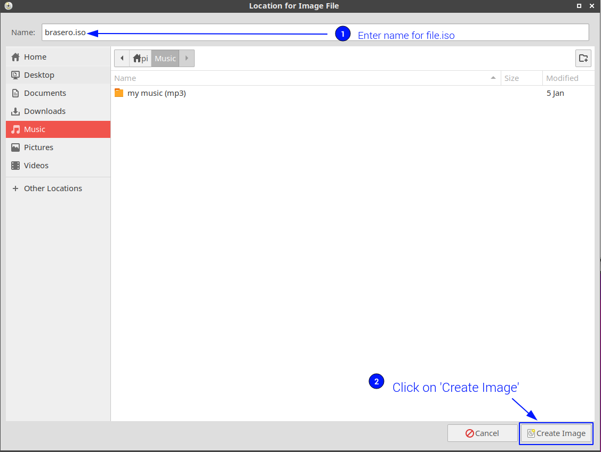
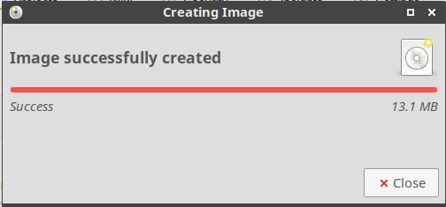

# How to add files to the VM

## Step 1: create the disk image:
1) on the pi install brasero like this: `sudo apt install brasero`.
2) put all the files you want in a folder somewhere you remember like `~/Documents/myfolder`.
3) open brasero and click on `Data project`

4) click on the plus sign in the top left corner.

5) select the folder/folders you want and click on 'Add'.

6) click on 'Burn' in the bottom right corner.

7) give the file a name, and then click on 'Create Image' in the bottom right corner.

8) wait untill you see a `Image successfully created` message like the one in the screenshot bellow:

## Step 2: boot the VM with the disk image mounted:
1) open terminal and type: `cd <VM>` but change <VM> with the name of the vm's folder. look for the table bellow for a list of names.
2) type the command to start your VM (the commands are in the [README](README.md)) but add this to its end: `-cdrom path/to/the/image/we/created/earlier.iso` but of course change `path/to/the/image/we/created/earlier.iso` with the real path to your image.

**DONE!**
when the VM boots up you should be able to copy the files from the image.
