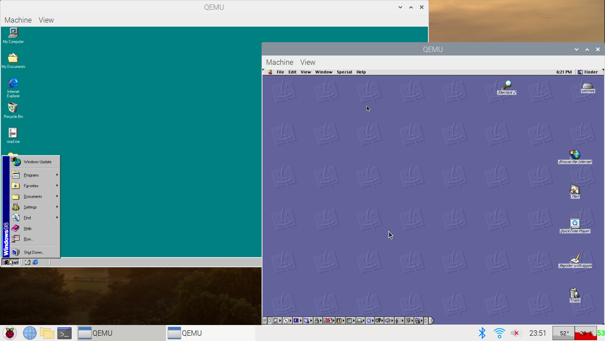
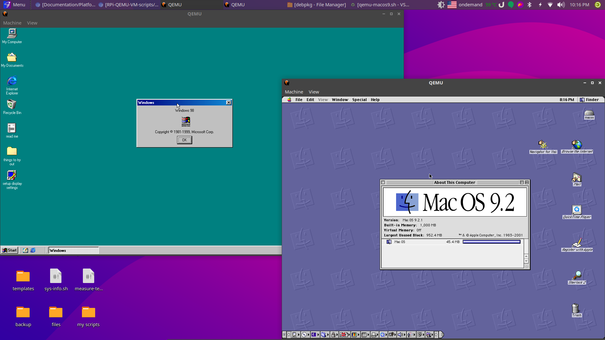
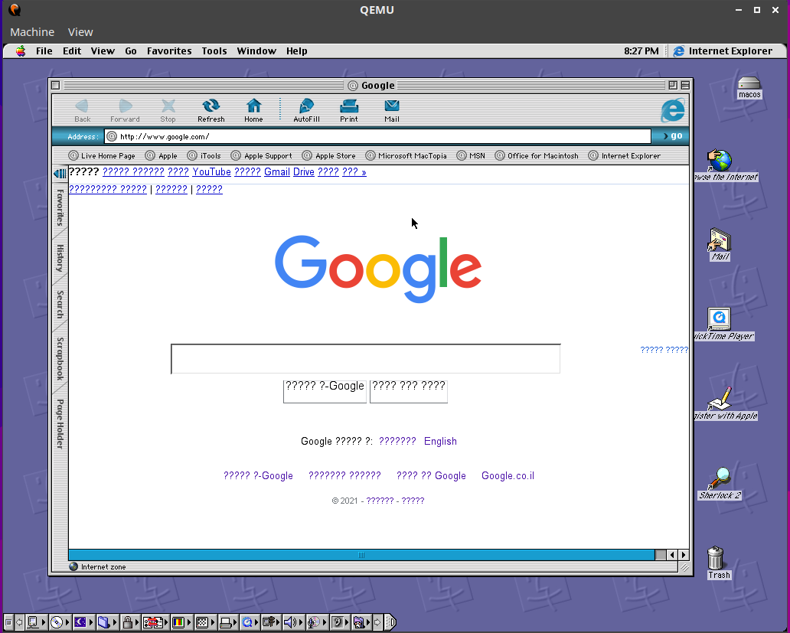
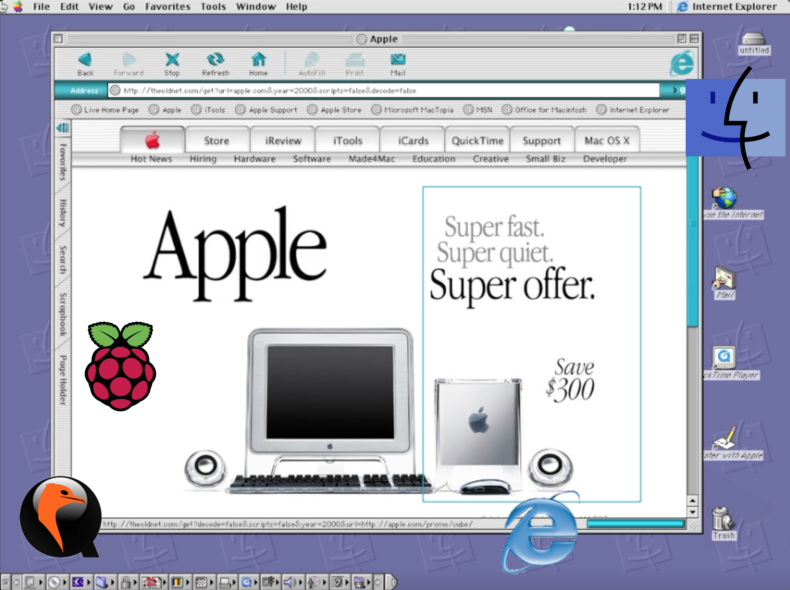

# QEMU-VM-scripts
### DISCLAIMER: the software provided is for educational and historical purposes only!


# IMPORTANT NOTE: **ALWAYS** shut down the VM's properly (macos 9: finder>special button on the toolbar>shutdown. win98: start menu>shutdown>ok). not doing so will corrupt the OS!

## All scripts:

### MacOS 9.2.1
**NOTES:**<br>don't use this VM if you have less than 2gb of RAM, to run it with less RAM, edit the following text in the desktop shortcut from `-m 1000` to `-m <amount of ram in mb>`

 **Website:** [my archive.org page for it](https://archive.org/details/macos_921_qemu_rpi)<br>
  
**How to install:** simply run the following in terminal:
```bash
wget https://raw.githubusercontent.com/Itai-Nelken/RPi-QEMU-VM-scripts/main/MacOS9.2/qemu-macos9.sh; bash qemu-macos9.sh
```
**How to remove:** simply run the following in terminal:
```bash
wget https://raw.githubusercontent.com/Itai-Nelken/RPi-QEMU-VM-scripts/main/MacOS9.2/remove-qemu-macos9.sh; bash remove-qemu-macos9.sh
```

**How to run:** from the Desktop shortcut or follow the instructions bellow:
  1) type the following in terminal to change to the VM folder (directory):
  ```bash
  cd ~/macos921
  ```
  2) type the following in terminal to start the VM:
  ```bash
  qemu-system-ppc -M mac99 -m 1000 -cpu "g4" -L pc-bios -g 1024x768x32 -hda macos921.qcow2 -name "MacOS 9.2.1"
  ```
  if you have less than 2gb of RAM, edit the `-m 1000` to `-m <amount of ram in mb>`. example: to give the VM 128mb I would put `-m 128`.
  
### Windows 98
**NOTES:**<br>don't use this VM if you have less than 2gb of RAM, to run it with less RAM, edit the following text in the desktop shortcut from `-m 1000` to `-m <amount of ram in mb>`

**How to install:** simply run the following in terminal:
```bash
wget https://raw.githubusercontent.com/Itai-Nelken/RPi-QEMU-VM-scripts/main/windows98/win98vm.sh; bash win98vm.sh
```
**How to remove:** simply run the following in terminal:
```bash
wget https://raw.githubusercontent.com/Itai-Nelken/RPi-QEMU-VM-scripts/main/windows98/win98vm-remove.sh; bash win98vm-remove.sh
```

**How to run:** from the Desktop shortcut or follow the instructions bellow:
  1) type the following in terminal to change to the VM folder (directory):
  ```bash
  cd ~/win98
  ```
  2) type the following in terminal to start the VM:
  ```bash
  qemu-system-x86_64 -name "Windows 98" -hda win98.qcow2 -device sb16
  ```
  if you have less than 2gb of RAM, edit the `-m 1000` to `-m <amount of ram in mb>`. example: to give the VM 128mb I would put `-m 128`.

<!--
anything inside here isn't visible.
put your script in here under the category using the following template:

### OS name
**Website:** (if applicable)<br>
  
**How to install:**<br>

**How to remove:**<br>
  
**How to run:**<br>
-->

# FAQ
### Q = question<br>A = answer

**Q:**
>How do I get files into the VM's?

**A:**
> using the steps [here](FILES2VM.md).


## Screenshots
### MacOS 9.2.1 and Windows 98 VM's running at the same time

### Google.com in Internet Explorer 5 Macintosh Edition


### Trying to browse the Web in IE 5 Mac edition


### Actually browsing the web using [theoldnet](http://theoldnet.com/) (click the thumbnail to play the video)
<a href="https://youtu.be/mPpQg8mEyz8">
  
</a>

<!--
<iframe width="560" height="315" src="https://www.youtube.com/embed/mPpQg8mEyz8" title="YouTube video player" frameborder="0" allow="accelerometer; autoplay; clipboard-write; encrypted-media; gyroscope; picture-in-picture" allowfullscreen></iframe>
-->
